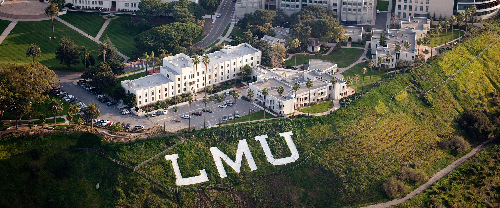

# LMU Computer Science Coursework  🦁

A directory of all relevant Computer Science coursework and projects I've completed at LMU

## Course Repositories  📚

### [CMSI 4320: Cognitive Systems Design](https://github.com/asrouji/cmsi4320)

### [CMSI 3300: Artificial Intelligence](https://github.com/asrouji/cmsi3300)

### [CMSI 3751/3752: Game Design & Development](https://github.com/asrouji/cmsi3752)

### [CMSI 3520: Database Systems](https://github.com/asrouji/cmsi3520)

### [CMSI 3801/3802: Languages and Automata I & II](https://github.com/asrouji/cmsi3801)

### [CMSI 2210: Computer Systems Organization](https://github.com/asrouji/cmsi2210)

### [CMSI 2130: Algorithms and Analysis](https://github.com/asrouji/cmsi2120)

### [CMSI 2120: Data Structures & Applications](https://github.com/asrouji/cmsi2120)

### [CMSI 2022: Mobile Application Development](https://github.com/asrouji/cmsi2022)

### [CMSI 298: Web Application Practicum](https://github.com/asrouji/cmsi298)

### [CMSI 186: Programming Laboratory](https://github.com/asrouji/cmsi186)

### [CMSI 185: Computer Programming](https://github.com/asrouji/cmsi185)
